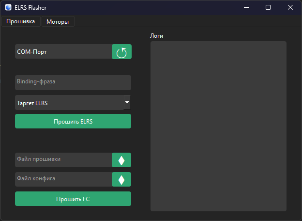
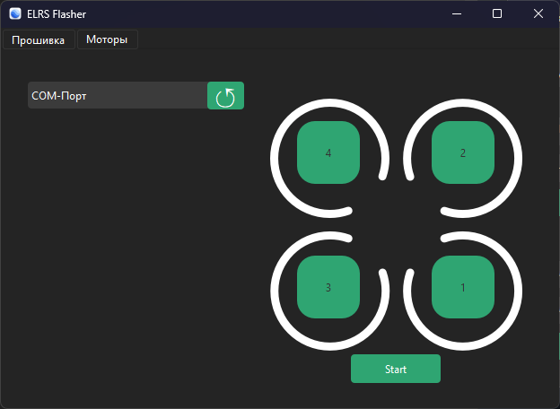

# UltraFlasher
### Инструмент для потоковой прошивки и диагности FPV беспилотников

## Возможности:
* Сборка прошивки под таргет и ее загрузка в ELRS приемник/передатчик
* Сборка прошивки под таргет и ее загрузка в FC (Полетный контроллер)
* Загрузка дампа/конфига в FC (Полетный контроллер)
* Проверка направления моторов и его изменение в интерактивном режиме

#### Интерфейс загрузчика

#### Интерфейс настройки моторов

## Вклад в проект

Мы приветствуем вклад в проект! Если у вас есть предложения или вы нашли ошибку, пожалуйста, создайте issue или отправьте pull request

## Лицензия

Этот проект лицензирован под MIT License

---
